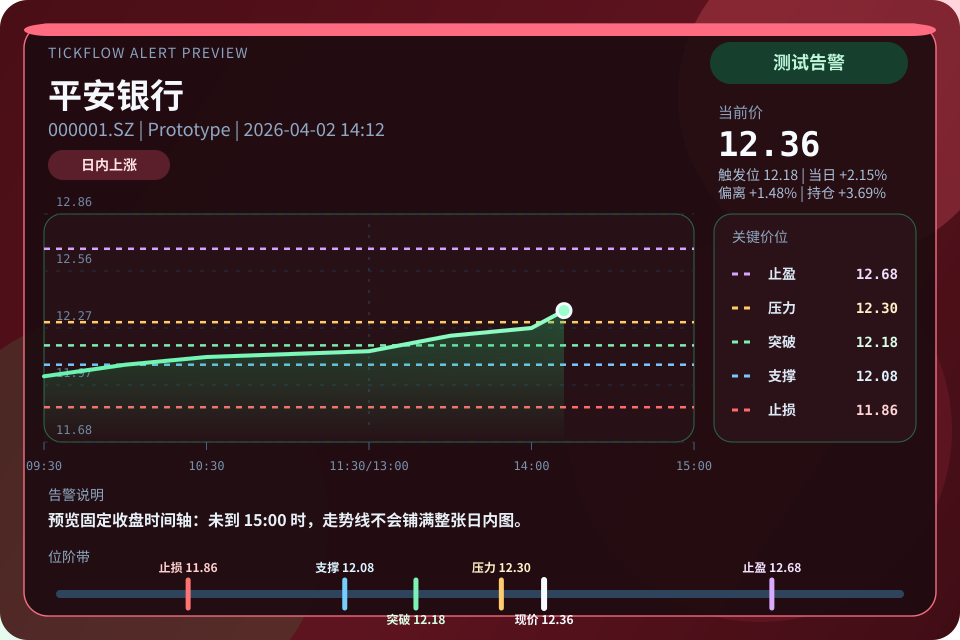

# 📈 TickFlow Assist Hermes

基于 [Hermes](https://hermes-agent.nousresearch.com/docs) 的 A 股监控与分析插件。它使用 [TickFlow API](https://tickflow.org/auth/register?ref=BUJ54JEDGE) 获取行情与财务数据，并可选接入 [金十数据 MCP](https://mcp.jin10.com/app/) 快讯流，结合 LLM 生成技术面、基本面、资讯面的综合判断，并把结果持久化到本地 LanceDB。

当前版本：`v0.3.9`。完整发布记录见 [CHANGELOG.md](CHANGELOG.md)。

当前主线架构：

- Hermes 插件是主入口
- Python 负责插件注册、工具实现、数据请求、分析、监控、日更、告警和 LanceDB 读写
- LanceDB 负责保存自选、K 线、指标、分析结果、关键价位、告警日志与金十快讯记录

兼容性要求：

- Hermes Agent 已安装并能加载本地 Python 插件
- Python `>=3.10`
- 建议通过本项目的一键安装脚本创建虚拟环境并安装依赖

## 🧭 项目简介

TickFlow Assist Hermes 面向一条完整的“自选管理 -> 数据抓取 -> 综合分析 -> 后台监控 -> 结果留痕”链路，适合在 Hermes 中做 A 股日常盯盘、收盘后复盘和分析结果沉淀。

本插件的 OpenClaw 版，详见 [tickflow-assist](https://github.com/robinspt/tickflow-assist)。

## ✨ 核心特性

- 数据抓取：支持日 K、分钟 K、实时行情、财务数据与金十数据快讯接入，收盘后可批量更新。
- 妙想增强：支持资讯搜索、官方金融数据查询、原始智能选股，以及限量候选池 + TickFlow 行情 / 日K联动补数据。
- 自选联动：支持读取东方财富自选、从东方财富同步到本地关注列表，以及把本地关注股推送或删除东方财富自选。
- 多维分析：技术面、财务面、资讯面按固定流水线执行，输出综合结论与关键价位。
- 监控告警：围绕止损、突破、支撑、压力、止盈、涨跌幅和成交量异动进行交易时段轮询，并支持金十数据 24 小时快讯候选筛选与事件告警。
- 阶段提醒：上午开盘、上午收盘、下午开盘、今日收盘各提醒一次，并按上午盘/下午盘持久化去重。
- 复盘留痕：收盘后自动生成活动关键价位快照，并提供 `1/3/5` 日回测统计。
- 本地数据库：使用 LanceDB 保存自选、K 线、指标、分析结果、关键价位、告警日志与金十快讯记录。

## 📚 文档导航

- 安装指南：[docs/installation.md](docs/installation.md)
- 使用指南：[docs/usage.md](docs/usage.md)
- 更新日志：[CHANGELOG.md](CHANGELOG.md)
- 插件清单：[plugin.yaml](plugin.yaml)
- 配置示例：[local.config.example.json](local.config.example.json)
- 内置技能：
  - [skills/stock-analysis/SKILL.md](skills/stock-analysis/SKILL.md)

## 🛠 安装与配置

如果你是从 GitHub 仓库开始安装，优先建议使用一键安装脚本。脚本会创建 Python 虚拟环境、安装依赖、链接 Hermes 插件目录，并生成或更新本地配置。

### 一键安装脚本（首选）

```bash
git clone https://github.com/robinspt/tickflow-assist-hermes.git
cd tickflow-assist-hermes
./setup-tickflow.sh
```

向导会自动完成：

- 检查 Python 版本
- 创建项目内 `.venv`，并执行 `.venv/bin/python -m pip install -e .`
- 如果项目目录或 `.venv` 不可写，回退到 `~/.local/share/tickflow-assist-hermes/venv`
- 写入 `.tickflow-assist-venv`，让 Hermes 运行时能找到实际虚拟环境依赖
- 将当前目录链接到 `~/.hermes/plugins/tickflow-assist`
- 清理指向本项目的 `~/.hermes/skills/ta*` 符号链接，避免命令走 skill 慢路径
- 交互式生成或更新 `local.config.json`

如果系统缺少 venv 支持，Debian/Ubuntu 可先执行：

```bash
sudo apt install python3-venv
```

如果项目目录不可写，也可以显式指定虚拟环境目录：

```bash
TICKFLOW_ASSIST_VENV=~/.local/share/tickflow-assist-hermes/venv ./setup-tickflow.sh
```

脚本完成后无需手动配置，直接执行下方“启用插件”步骤。

### 手动源码安装

```bash
git clone https://github.com/robinspt/tickflow-assist-hermes.git
cd tickflow-assist-hermes
python3 -m venv .venv
.venv/bin/python -m pip install -e .
mkdir -p ~/.hermes/plugins
ln -s "$(pwd)" ~/.hermes/plugins/tickflow-assist
```

如果没有运行一键安装脚本，请先完成下方“手动配置”，再启用插件。

#### 手动配置（跳过安装脚本时）

一键安装脚本会交互式生成或更新仓库根目录的 `local.config.json`，脚本安装用户无需按本节手动配置。本节只适用于手动源码安装、非交互部署，或后续直接编辑配置文件的场景。插件读取 `local.config.json` 的 `plugin` 字段，本仓库提供 [local.config.example.json](local.config.example.json)。

核心必填建议先准备：

- `tickflowApiKey`
- `tickflowApiKeyLevel`
- `llmApiKey`
- `llmBaseUrl`
- `llmModel`

告警、快讯和妙想场景可按需配置：

- `alertDeliveryTarget`
- `alertImageEnabled`
- `jin10ApiToken`
- `mxSearchApiKey`

也可以使用环境变量：

```bash
export TICKFLOW_ASSIST_TICKFLOW_API_KEY="your-tickflow-key"
export TICKFLOW_ASSIST_TICKFLOW_API_KEY_LEVEL="Free"
export TICKFLOW_ASSIST_LLM_BASE_URL="https://api.openai.com/v1"
export TICKFLOW_ASSIST_LLM_API_KEY="sk-xxx"
export TICKFLOW_ASSIST_LLM_MODEL="gpt-4o"
```

可选：

```bash
export TICKFLOW_ASSIST_MX_SEARCH_API_KEY="mkt_xxx"
export TICKFLOW_ASSIST_JIN10_API_TOKEN="jin10_xxx"
export TICKFLOW_ASSIST_DATABASE_PATH="./data/lancedb"
export TICKFLOW_ASSIST_ALERT_DELIVERY_TARGET="telegram"
export TICKFLOW_ASSIST_ALERT_IMAGE_ENABLED="true"
```

`alertDeliveryTarget` 使用 Hermes delivery target 格式，常见示例：

- `telegram`：发送到 Telegram home channel
- `telegram:-1001234567890`：发送到指定 Telegram 群
- `telegram:-1001234567890:17585`：发送到指定 Telegram topic
- `discord:999888777`：发送到指定 Discord channel
- `slack`：发送到 Slack home channel

### 启用插件

Hermes 插件默认是 opt-in。源码目录链接到 `~/.hermes/plugins/tickflow-assist` 后，还需要显式启用插件：

```bash
hermes plugins enable tickflow-assist
hermes plugins list
hermes gateway restart
```

也可以运行 `hermes plugins` 打开交互式插件管理界面，用空格勾选 `tickflow-assist`。

重启 Hermes gateway 后，在 Hermes chat / CLI 中运行 `/plugins`，应能看到 `tickflow-assist`。Telegram 可在命令列表中选择 `/ta_*` 命令并直接使用；Discord 目前不会在 `/` 菜单展示插件命令，但可以手动输入 `/ta_*` 或 `/ta-*` 命令触发。如果 Telegram 没有显示 `/ta_*`，说明 gateway 进程尚未加载插件命令，需要重启 gateway。

## 🔄 升级

如果你通过本地源码目录安装，进入仓库后执行：

```bash
git pull
./setup-tickflow.sh
```

然后重启 Hermes gateway。脚本会检查并补齐 Python 依赖、配置文件和插件目录链接。

如果 `.venv` 使用的 Python 版本与 Hermes 运行时不一致，脚本会把已有虚拟环境挪到 `.venv.pyX.Y.bak.*` 并重建。`/plugins` 正常但 `/ta_addstock` 提示缺少 `lancedb`、`pandas` 等依赖时，请重新运行 `./setup-tickflow.sh`，确认输出包含“Python 依赖检查通过”和“已记录虚拟环境路径”，然后重启 Hermes；若问题还在，运行 `/ta_debug` 查看当前 Python、依赖和路径。

## 🚀 使用方式

常见入口有三种：

- Hermes 对话：直接说“添加 002261”“分析 002261”“开始监控”。
- Slash Command：使用 `/ta_addstock`、`/ta_analyze`、`/ta_monitorstatus`、`/ta_flashstatus` 等免 AI 直达命令。
- 本地 Python 调试：直接导入 `tickflow_assist.tools` 调用工具 handler。

常用示例：

```text
添加 002261
分析 002261
同步东方财富自选到本地
把本地自选全部推送到东方财富
/ta_addstock 002261 34.15
/ta_monitorstatus
/ta_flashstatus
/ta_testalert
```

本地 Python 调试示例：

```bash
python3 -B - <<'PY'
from tickflow_assist.tools import add_stock
print(add_stock({"symbol": "002261", "costPrice": 34.15}))
PY
```

Hermes 中注册 `/ta_` 插件 Slash Commands，handler 直接调用工具并返回 `text`，不会加载 skill，也不会走模型规划。Telegram 可从命令列表选择 `/ta_*`；Discord 菜单目前不展示插件命令，需要手动输入 `/ta_*` 或 `/ta-*`。本插件同时注册 `ta-*` 兼容别名，因为 Hermes gateway 在消息端分发插件命令时可能会把下划线命令名转换为连字符后查找；Telegram 菜单显示 `/ta_*`。

更完整的指令分类、Slash Command 列表与运行规则见 [docs/usage.md](docs/usage.md)。

## 🧩 架构与目录

后台任务在 Hermes 进程内运行：实时监控、定时日更与金十数据快讯监控分别由 Python daemon thread 执行。定时日更默认随插件加载启动，可用 `/ta_stopdailyupdate` 手动停用；它包含 09:20 盘前资讯、15:25 日更和 20:00 收盘复盘。

```text
tickflow-assist-hermes/
├── docs/                         # 安装、使用与示例文档
├── tickflow_assist/              # 主业务 Python 包
├── tickflow_assist/plugin.py     # Hermes register(ctx) 入口
├── tickflow_assist/tools.py      # 工具 handler
├── tickflow_assist/core.py       # 核心业务流程
├── tickflow_assist/storage.py    # LanceDB schema 与读写层
├── tickflow_assist/clients.py    # TickFlow、妙想、金十、LLM 客户端
├── tickflow_assist/alert_media.py # PNG 告警卡生成
├── skills/                       # 插件内置 skills
├── tests/                        # Hermes 注册与兼容测试
├── plugin.yaml                   # Hermes 插件清单
├── setup-tickflow.sh             # 一键安装脚本
├── local.config.example.json     # 配置示例
├── CHANGELOG.md                  # 更新日志
└── README.md                     # 项目概览
```

## 🔌 依赖与可选能力

- [TickFlow](https://tickflow.org/auth/register?ref=BUJ54JEDGE)：`Free` 可用日线与实时行情；`Starter` 起可用标的池，插件会用来做申万行业映射与申万 3 级同业表现；`Pro` 起可用分钟K；`Expert` 才走 TickFlow 财务数据，非 `Expert` 默认回退妙想 lite。
- Hermes：负责插件运行、工具注册、对话入口与消息投递。
- Python 依赖：`lancedb`、`pyarrow`、`pandas`、`numpy`、`requests`、`Pillow` 等由安装脚本安装到虚拟环境。
- [金十数据 MCP](https://mcp.jin10.com/app/)：可选，用于 24 小时快讯流接入、自选关联筛选与事件驱动告警。
- [东方财富妙想 Skills](https://marketing.dfcfs.com/views/finskillshub/)：可选，用于 `mx_search`、`mx_data`、`mx_select_stock`、东方财富自选同步，以及非 Expert 财务链路的 lite 补充；自选管理接口每日额度 200 次。

## ⚠️ 风险提示

本项目仅用于策略研究、流程验证与教学交流，不构成任何形式的投资建议、收益承诺或具体交易指引。

- 市场环境、流动性、执行价格与个人交易纪律都会影响实际结果，历史表现不代表未来收益。
- AI 模型、自动化分析与回测结果都可能存在偏差、遗漏或失效，不应作为单一决策依据。
- 使用前请结合自身资金情况、风险承受能力与独立判断审慎评估，并自行承担相应风险。

## 🖼 效果预览

`/ta_testalert` 会同时验证文本和 PNG 告警卡链路。下图为当前测试告警样式示例：



## 📝 更新记录

完整历史发布记录见 [CHANGELOG.md](CHANGELOG.md)。

## 🙏 鸣谢

- [TickFlow](https://tickflow.org/auth/register?ref=BUJ54JEDGE) 提供行情数据服务与 API 支持
- [Hermes](https://hermes-agent.nousresearch.com/docs) 提供插件运行、对话通道与工具编排能力
- [CortexReach/memory-lancedb-pro](https://github.com/CortexReach/memory-lancedb-pro) 为长期记忆和 LanceDB 使用提供参考

## 📄 License

MIT
